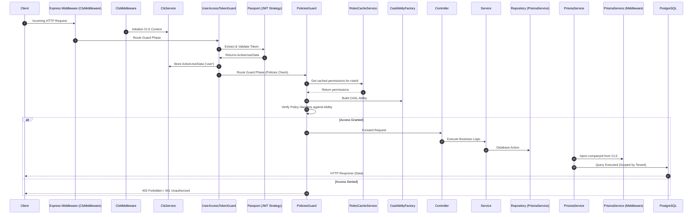

# SaaS Platform Architecture & Flow

This document details the high-level architecture of the NestJS + Prisma SaaS platform, explaining request lifecycles, security guard synchronization, and tenant isolation mechanics.

---

## 1. Request Lifecycle Overview

Every HTTP request targeted at tenant-scoped resources goes through the following sequence:

---

## 2. Multi-Tenant Isolation (Prisma Level)

To guarantee absolute tenant isolation, we use NestJS **CLS (Continuation Local Storage)** in combination with a custom Prisma query middleware.

### How it works:
1. **Context Initialization**: `ClsMiddleware` boots up a context for the thread.
2. **Context Seeding**: `UserAccessTokenGuard` validates the JWT token and writes the user data (containing `companyId` and `isSuperUser` status) into the CLS store under the `'user'` key.
3. **Query Scoping**: [PrismaService](file:///c:/Users/Gio/Desktop/fitness-saas-prisma/src/prisma/prisma.service.ts) runs a middleware on every query:
   - For **Reads** (`findFirst`, `findMany`, etc.): Appends `{ companyId: user.companyId }` to the query's `where` clause automatically.
   - For **Writes** (`create`, `createMany`): Injects `companyId: user.companyId` to ensure records cannot be orphaned or assigned to other companies.
   - For **Updates/Deletes** (`update`, `delete`): Queries the database using a separated, non-isolated `rawClient` instance (to prevent infinite recursion) to check if the record exists under the user's `companyId` before executing the modification.

---

## 3. Permission Caching Layer

To scale the authentication system under high traffic, permissions are cached at the role level.

### Cache Strategy:
- **RolesCacheService**: Stores role permissions inside an in-memory `Map` keyed by `roleId`.
- **Invalidation**: Whenever a role is updated or deleted through `RolesService`, it triggers `rolesCacheService.invalidate(roleId)` instantly, ensuring that permissions remain up-to-date and consistent.
