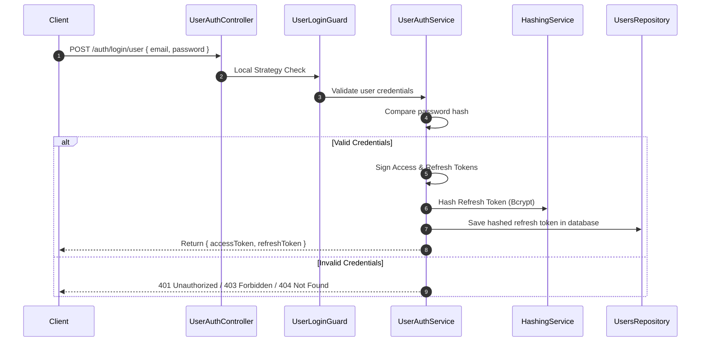

# Authentication & Registration Flow

This document details the authentication mechanism, token rotation strategy, and registration flow for new tenants.

---

## 1. Tenant Registration Flow (`POST /companies/register`)

The registration endpoint is public and allows new companies (tenants) to sign up. 

### Sequence:
1. **Pre-registration Check**: Checks if the administrator's email is already registered. If yes, throws a `ConflictException`.
2. **Password Encryption**: Hashes the administrator password using `bcrypt` before database entry.
3. **Database Transaction (`$transaction`)**:
   - Creates the `Company` entity (Tenant).
   - Creates the `Branch` entity (Main Branch).
   - Creates the `Department` entity (Management).
   - Creates the default `company_admin` `Role` and maps the request permissions to it.
   - Creates the `User` (Administrator) entity and links it to the company, branch, department, and role.
4. **Response**: Returns the created entities, excluding the user's password.

---

## 2. Authentication Flow (`POST /auth/login/user`)

Our platform uses double-token JWT authentication (Access Token + Refresh Token).

### Token Strategy:
| Token Type | Lifespan | Secret Key | Contained Claims |
| :--- | :--- | :--- | :--- |
| **Access Token** | 1 Day | `KEY` | `userId`, `roleId`, `companyId`, `branchId`, `email`, `firstName`, `lastName`, `isSuperUser` |
| **Refresh Token** | 30 Days | `JWT_REFRESH_SECRET` | Same claims as Access Token |

### Secure Token Lifecycle:

---

## 3. Token Rotation & Refresh (`POST /auth/refresh`)

To prevent replay attacks and ensure security, we store hashed refresh tokens in the database and rotate them on every refresh.

### Sequence:
1. **Request Guarding**: `JwtRefreshUserGuard` extracts and verifies the signature of the incoming Refresh Token.
2. **Database Lookup**: The service retrieves the user's record from the database.
3. **Hash Comparison**: Uses `bcrypt.compare` to verify the incoming token matches the saved hash.
4. **Token Generation**: Signs a new pair of Access and Refresh tokens.
5. **Database Sync**: Hashes the new Refresh token and overwrites the old hash in the database, invalidating the old token immediately.
6. **Response**: Returns the new `{ accessToken, refreshToken }` pair.

---

## 4. Logout Flow (`POST /auth/logout`)

- Guarded by `UserAccessTokenGuard`.
- Overwrites the user's stored refresh token field to `null` in the database, rendering all refresh tokens invalid immediately.
